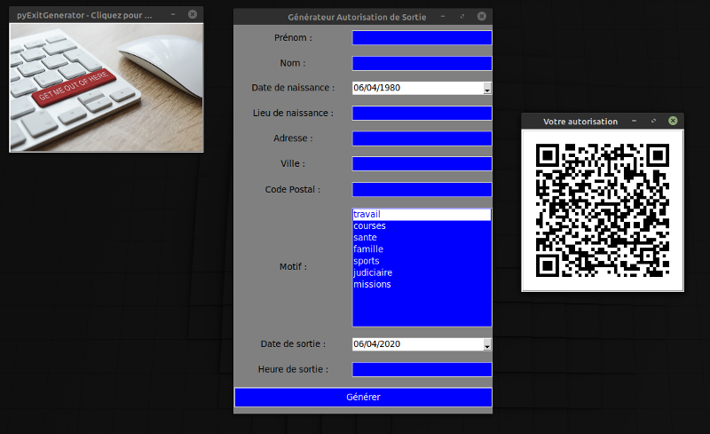

# pyExitGenerator

Outil de génération d'autorisation de sortie OpenSource.

Le voici !

 

Pour enregistrer votre attestation, un simple clique sur le qrcode l'enregistre directement.

Pour moi ça a été l'occasion d'utiliser une librairie de génération de qrcode, c'était chouette.